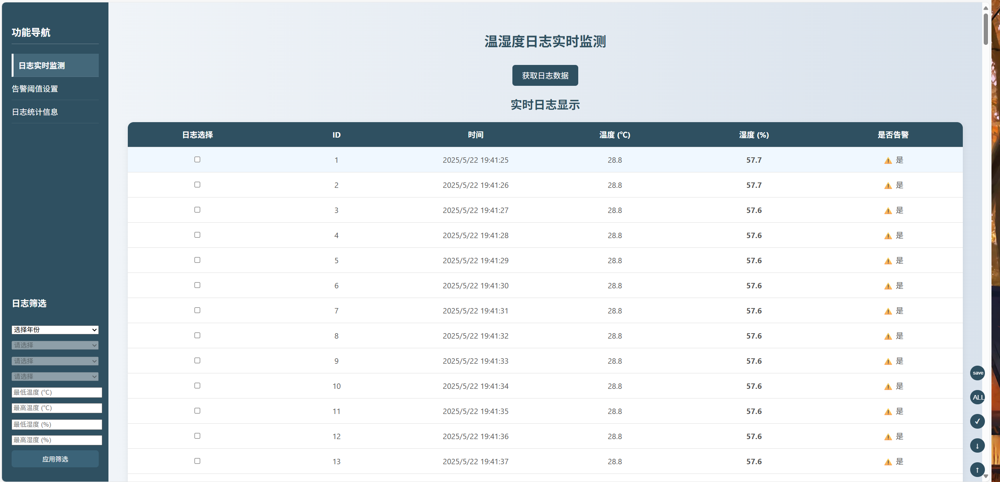

# 农业温湿度传感器感知网络

## 1 介绍
本程序实现了一个温湿度传感器的后端系统，从开发板中读取对应的温湿度信息，
然后存储到数据库中，最后通过前端显示对应的日志信息。

### 1.1 预期实现功能

- 从开发板中读取数据到数据库中 ✅
- 批量获取日志(带过滤器的获取) ✅
- 修改阈值(修改告警阈值) ✅
- 实现服务器异常处理(参数验证) 📌
- 批量删除废旧日志(带过滤器的删除) 📌
- 下载日志(带过滤器) 📌
- 实现前端 📌


### 1.2 可能可以实现的功能
- 带地图定位(前端实现一个地图的定位 可以定位不同传感器的位置) 📌
- 反向控制传感器 📌
- 传感器通过网络传输数据(不仅仅是串口) 📌

### 1.2 项目目录
```
sensor
│ 
├── src
│   ├── main #主要源代码
|   |   ├── java
|   |   |    └── com.example.sensor
|   |   |   
|   |   └── resources #一些资源配置文件   
|   |
│   └── test #测试文件
|
├── target 
└── README.md
```

### 1.3 网页路由
```
localhost:port{
    /log{ [POST]
        /log/logId [GET/PUT/DELETE]
    }
    /log_alert [POST] 
    /log_bacth [GET]
    /log_filter [POST]
}

```

## 2 ``@Controller``接口

### 2.1 ``LogDataController`` 
实现单个日志的增删查改。

### 2.2 ``LogDataBatchController``
实现批量日志的增删查改，通过前端传入的过滤器进行日期过滤(后续考虑添加温度过滤)。

### 2.3 ``LogAlertManagerController``
实现单例类``LogAlertManager``的控制接口，通过前端的控制返回对应的日志告警范围。

## 3 ``@Service``

### 3.1 ``LogDataService``
实现日志增删查改的服务。

### 3.2 ``LogDataBatchService``
实现批量查询服务。

### 3.3 ``SerialLogService``
实现从串口中读取信息的服务，并且进行日志信息的过滤，写入数据库。

## 3 前端实现

### 3.1 基本显示功能

+ 首先实现最基本的显示，即不带过滤器(前端写死过滤逻辑)的显示，在网页中显示批量的日志。
(此处的逻辑可以写死成一个巨大的范围，比如1970年1月1日到2100年1月1日、温度从-10000 ~ 10000，湿度从0 ~ 100)
+ 其次实现带过滤器的显示，即提供**温度范围**、**湿度范围**的输入栏，以及**是否为告警日志**的勾选栏，
用户可以选择对应的范围，然后前端获取之后构造一个对应的json发送给后端，得到批量的日志。
+ 最后实现一个侧边栏，通过``年 -> 月 -> 日 -> 小时``四级目录，让用户更方便地进行日期过滤，同时上述功能也应保留。
由于此时网页的侧边栏是动态的，所以``HTML``文件需要从``JS``中动态构建(获取一头一尾的日期，然后构建)。

### 3.2 告警范围选择

+ 增加一个告警范围自定义，用户可以通过前端自定义后续的日志告警范围，其实现和上述相同，只需要提交对应json到对应的接口即可。

### 3.3 统计功能

+ 点击统计功能后，每个日志前增加一个勾选栏目，用户勾选完需要统计的日志后确认，前端发送被勾选的日志到后端，后端统计出
被勾选日志的信息(包含平均温度，平均湿度，最高温，最低温)返回给前端。
+ (可能可以实现)，返回一个温度趋势表。