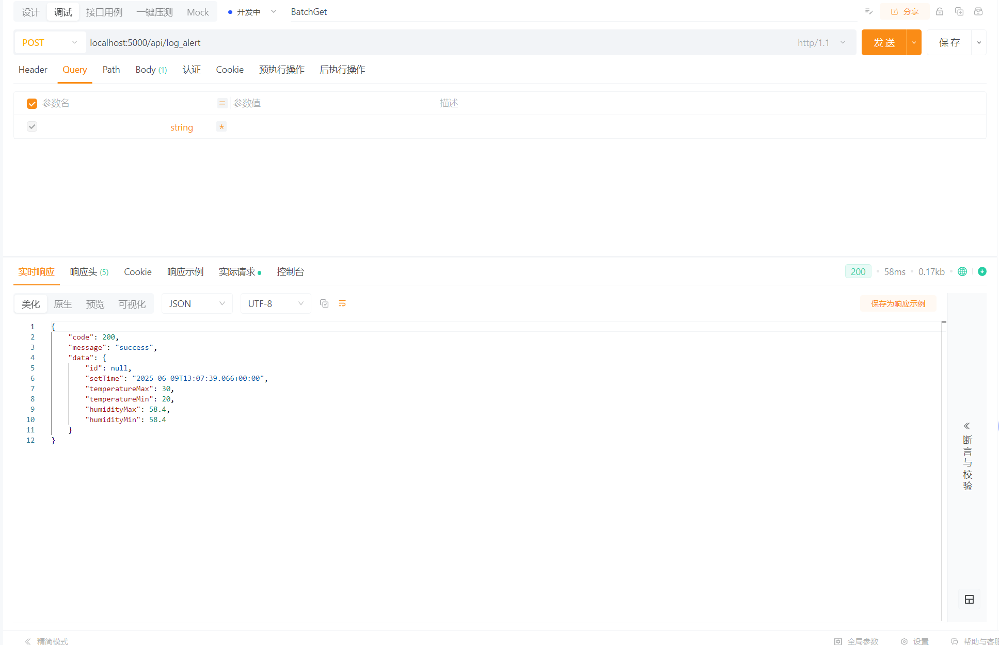
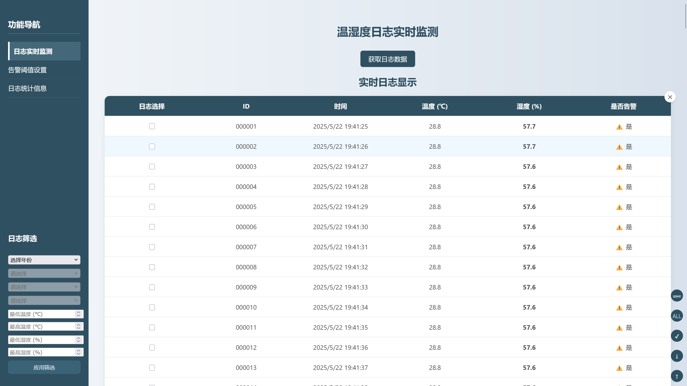
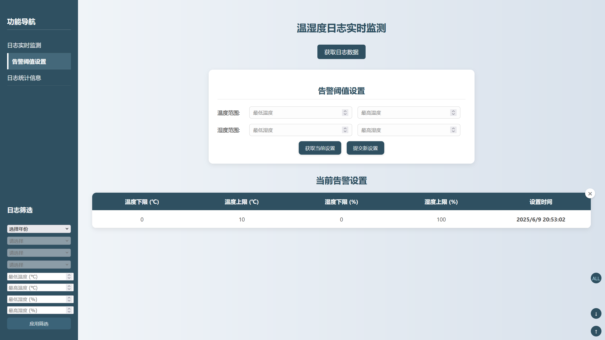
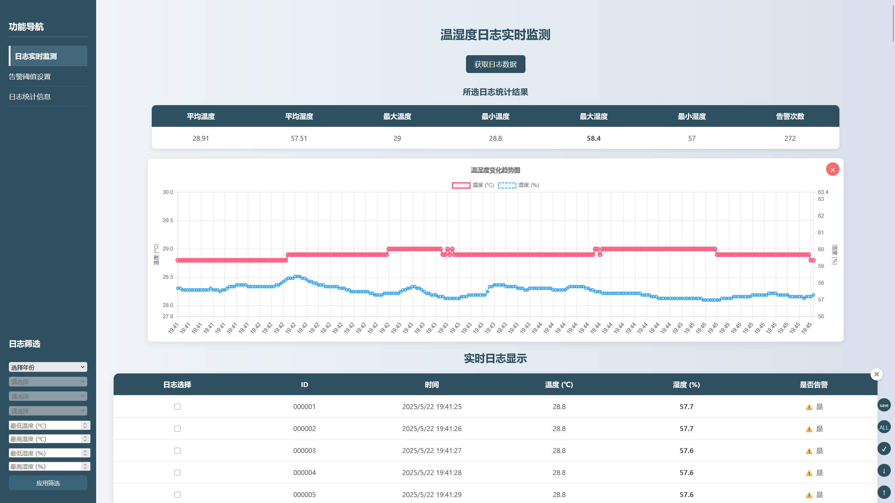

# 农业温湿度传感器感知网络实验报告

## 1 引言

### 1.1 研究背景及需求

随着智慧农业的发展，实时监测农田环境参数对提高农作物产量和质量至关重要。
传统的人工监测方式存在效率低、实时性差等问题。
本项目旨在构建一个基于物联网技术的农业温湿度监测系统，实现环境数据的自动化采集、智能分析和实时预警，为农业生产提供数据支持。

### 1.2 实验目标与预期结果

- 实现温湿度数据的实时采集与存储
- 开发数据可视化界面展示环境变化趋势
- 建立可配置的阈值预警机制
- 提供数据统计分析功能
- 构建一个稳定可靠、操作简便的农业环境监测平台

## 2 软件架构

### 2.1 传感器架构

- 采用谷雨科技开发板作为硬件平台
- 通过串口通信与后端服务交互
- 支持温湿度数据的周期性采集

### 2.2 后端架构

- 基于``Spring Boot``框架的``RESTful API``服务
- 核心组件：

    - 控制接口层：``LogDataBatchController``、``LogAlertManagerController``

    - 业务逻辑层：``LogDataBatchService``、``LogDataStatisticService``

    - 数据持久层：``LogDataRepository``、``LogAlertManagerRepository``

- 数据库：``MySQL 8.0``作为数据存储
    
    - 创建数据库表：``log_data``用于存储温湿度数据。

- 异常处理：``GlobalExceptionHandler``进行全局异常捕获和处理，返回统一格式的错误响应

### 2.3 前端架构

前端采用``HTML5 + CSS3 + JavaScript``技术栈，使用``Chart.js``进行数据可视化展示。支持数据轮询获取和实时更新。

## 3 开发环境

### 3.1 硬件配置

- 谷雨科技温湿度传感器开发板
- 计算机(运行后端服务)
- 串口通信线缆

### 3.2 软件环境

- JDK 17
- Apache Maven 3.9.9
- MySQL 8.0
- 开发工具：intelliJ IDEA 2023.2.4
- 浏览器：Chrome/Firefox

### 3.3 项目结构

```
sensor
├── pom.xml # Maven依赖配置文件
├── README.md # 项目说明文档
├── src
│   ├── main
│   │   ├── java/com/example/sensor # Java源代码目录
│   │   │   ├── controller # 控制器层
│   │   │   ├── pojo # 实体类
│   │   │   ├── service # 服务层
│   │   │   ├── exception # 异常处理
│   │   └── resources # 配置文件目录
│   │       ├── application.properties # 应用配置文件
│   │       └── static # 静态资源目录
│   └── test # 测试代码目录
│
└── target # 构建输出目录
```

## 4 实验步骤

### 4.1 核心功能实现

#### 4.1.1 数据采集模块：
``SerialLogService.java``中实现串口通信，定时读取传感器数据，从传感器中读取数据并解析数据为温湿度值，存储到数据库中。

```java
// 开始监听串口数据
public void startListening() {
    new Thread(() -> {
        try {
            serialPort.openPort();
            serialPort.setParams(115200, 8, 1, 0); // 设置波特率、数据位、停止位、校验位
            StringBuilder buffer = new StringBuilder();
            while (true) {
                byte[] data = serialPort.readBytes(); // 读取串口数据
                if (data != null) {
                    buffer.append(new String(data));
                    if (buffer.toString().contains("\r\n")) { // 当数据完整时才处理
                        saveLog(buffer.toString().split(","));
                        buffer.setLength(0); // 清空缓冲区
                    }
                }
            }
        } catch (SerialPortException e) {
            e.printStackTrace();
        }
    }).start();
}

```
#### 4.1.2 日志管理模块：
日志数据管理通过服务层``LogDataBatchService.java``实现，其调用``LogDataRepository.java``进行数据的增删改查操作，同时提供为接口提供批量获取、统计分析等功能。
```java
@Service
public class LogDataBatchService {
    
    private final LogDataRepository logDataRepository;
    @Autowired
    public LogDataBatchService(LogDataRepository logDataRepository) {
        this.logDataRepository = logDataRepository;
    }
    
    //获取批量日志数据
    public ArrayList<LogData> fetchBatchLog(LogFilterDto logFilterDto){
        var logFilter = logFilterDto ==null? null : new LogFilter(logFilterDto);
        //如果没有过滤器 批量发送所有数据
        if(logFilter == null){
            ArrayList<LogData> logDatas = new ArrayList<LogData>();
            for (LogData logData : logDataRepository.findAll()) {
                logDatas.add(logData);
            }
            return logDatas;
        }
        //如果有过滤器
        else{
            return switch (logFilter.getIsAlert()) {
                case ALERT -> logDataRepository.findByLogTimeBetweenAndTemperatureBetweenAndHumidityBetweenAndAlert(
                        logFilter.getStartDate(), logFilter.getEndDate(),
                        logFilter.getTemperatureMin(), logFilter.getTemperatureMax(),
                        logFilter.getHumidityMin(), logFilter.getHumidityMax(),
                        true
                );
                case NOT_ALERT -> logDataRepository.findByLogTimeBetweenAndTemperatureBetweenAndHumidityBetweenAndAlert(
                        logFilter.getStartDate(), logFilter.getEndDate(),
                        logFilter.getTemperatureMin(), logFilter.getTemperatureMax(),
                        logFilter.getHumidityMin(), logFilter.getHumidityMax(),
                        false
                );
                case ALL -> logDataRepository.findByLogTimeBetweenAndTemperatureBetweenAndHumidityBetween(
                        logFilter.getStartDate(), logFilter.getEndDate(),
                        logFilter.getTemperatureMin(), logFilter.getTemperatureMax(),
                        logFilter.getHumidityMin(), logFilter.getHumidityMax()
                );
            };
        }
    }
    
    //统计日志数据
    public ArrayList<LogData> deleteBatchLog(IdListDto idListDto){
        ArrayList<LogData> logDataArrayList = new ArrayList<>();
        for(var logId:idListDto.getIds()){
            var logData = logDataRepository.findById(logId);
            if(logData.isPresent()){
                logDataArrayList.add(new LogData(logData.get()));
                logDataRepository.deleteById(logId);
            }
        }
        return logDataArrayList;
    }
    
    //按 ID 列表获取日志数据
    public ArrayList<LogData> fetchBatchLogById(IdListDto idListDto) {
        ArrayList<LogData> logDataArrayList = new ArrayList<>();
        for (var logId : idListDto.getIds()) {
            var logData = logDataRepository.findById(logId);
            logData.ifPresent(logDataArrayList::add);
        }
        return logDataArrayList;
    }
}
```

#### 4.1.3 告警系统模块：
告警管理类``LogAlertManager.java``实现了告警阈值的设置和判断逻辑，其以单例模式存在，提供了获取和设置告警阈值的服务。
```java
public class LogAlertManager {
    private Integer id;
    private Timestamp setTime;
    private Double temperatureMax;
    private Double temperatureMin;
    private Double humidityMax;
    private Double humidityMin;

    public LogAlertManager() {
        setTime = new Timestamp(System.currentTimeMillis());
        //默认设置
        temperatureMax = 10D;
        temperatureMin = 0D;
        humidityMax = 100D;
        humidityMin = 0D;
    }
    
    private boolean isTemperatureInRange(Double temperature){
        return temperature <= this.temperatureMax && temperature >= this.temperatureMin;
    }

    private boolean isHumidityInRange(Double humidity){
        return humidity <= this.humidityMax && humidity >= this.humidityMin;
    }

    public void setLogAlertManager(LogAlertManagerDto logAlertManagerDto){
        this.temperatureMin = logAlertManagerDto.getTemperatureMin();
        this.temperatureMax = logAlertManagerDto.getTemperatureMax();
        this.humidityMax = logAlertManagerDto.getHumidityMax();
        this.humidityMin = logAlertManagerDto.getHumidityMin();
        this.setTime = new Timestamp(System.currentTimeMillis());
    }

    public boolean isAlert(LogData logData){
        return !(isTemperatureInRange(logData.getTemperature()) && isHumidityInRange(logData.getHumidity()));
    }
    
    //省略其他getter和setter方法
}

```
告警管理类在从串口中读取到数据后，进行阈值判断，如果超过设定的阈值，则触发告警。
```java
public void saveLog(String[] logMessage) {
    var logData = parserLogMessage(logMessage);
    if (logData != null) {
        logData.setAlert(logAlertManager.isAlert(logData));
        logDataRepository.save(logData);
    }else{
        System.out.println("FAIL!");
    }
}
```

#### 4.1.4异常处理机制：

全局异常处理类``GlobalExceptionHandler.java``实现了对常见异常的捕获和处理，返回统一格式的错误响应。
```java
@RestControllerAdvice
public class GlobalExceptionHandler {

    @ExceptionHandler(MethodArgumentNotValidException.class)
    @ResponseStatus(HttpStatus.BAD_REQUEST)
    public Map<String, String> handleValidationExceptions(MethodArgumentNotValidException ex) {
        Map<String, String> errors = new HashMap<>();
        ex.getBindingResult().getFieldErrors().forEach(error ->
                errors.put(error.getField(), error.getDefaultMessage()));
        return errors;
    }

    @ExceptionHandler(Exception.class)
    @ResponseStatus(HttpStatus.INTERNAL_SERVER_ERROR)
    public Map<String, String> handleGenericException(Exception ex) {
        Map<String, String> errorResponse = new HashMap<>();
        errorResponse.put("error", "服务器内部错误");
        errorResponse.put("message", ex.getMessage());
        return errorResponse;
    }
}
```

### 4.2 接口设计与实现
详细的接口设计文档使用``Swagger``进行描述，提供了清晰的API文档和测试接口。

#### 4.2.1 日志相关接口

```java
@RestController
@RequestMapping("api/log_batch")
@Tag(name = "日志批量处理", description = "日志批量处理相关接口")
public class LogDataBatchController {
    private final LogDataBatchService logDataBatchService;
    private final LogDataStatisticService logDataStatisticService;

    @Autowired
    public LogDataBatchController(LogDataBatchService logDataBatchService, LogDataStatisticService logDataStatisticService) {
        this.logDataBatchService = logDataBatchService;

         this.logDataStatisticService = logDataStatisticService;
    }
    //获取批量数据
    @PostMapping
    @Operation(summary = "获取批量日志数据", description = "根据提供的过滤条件获取批量日志数据，需提供LogFilterDto对象")
    public ResponseMessage<ArrayList<LogData>> getBatchLogData(@RequestBody LogFilterDto logFilterDto){
        var res = logDataBatchService.fetchBatchLog(logFilterDto);
        if(res.isEmpty()){
            return ResponseMessage.NoContent(null);
        }
        else{
            return ResponseMessage.Success(res);
        }
    }

    @PostMapping("by-id")
    @Operation(summary = "按照ID列表获取日志数据", description = "根据提供的ID列表获取日志数据，需提供IdListDto对象")
    public ResponseMessage<ArrayList<LogData>> getBatchLogDataById(@RequestBody IdListDto idListDto){
        ArrayList<LogData> logDataArrayList = logDataBatchService.fetchBatchLogById(idListDto);
        return logDataArrayList.isEmpty() ?
            ResponseMessage.NoContent(null) :
            ResponseMessage.Success(logDataArrayList);
    }

    //统计日志信息
    @PostMapping("statistic")
    @Operation(summary = "统计日志数据", description = "根据提供的ID列表统计日志数据，需提供IdListDto对象")
    public ResponseMessage<LogDataStaticData> statisticLogData(@RequestBody IdListDto idListDto){
        LogDataStaticData logDataStaticData = logDataStatisticService.statisticLogData(idListDto);
        if (logDataStaticData == null) {
            return ResponseMessage.NoContent(null);
        } else {
            return ResponseMessage.Success(logDataStaticData);
        }
    }

    //删除日志
    @DeleteMapping
    @Operation(summary = "批量删除日志数据", description = "根据提供的ID列表批量删除日志数据，需提供IdListDto对象")
    public ResponseMessage<ArrayList<LogData>> deleteBatchLogData(@RequestBody IdListDto idListDto){
        ArrayList<LogData> logDataArrayList = logDataBatchService.deleteBatchLog(idListDto);
        if(logDataArrayList.isEmpty()){
            return ResponseMessage.NoContent(null);
        } else {
            return ResponseMessage.Success(logDataArrayList);
        }
    }
}
```
#### 4.2.2 告警相关接口

```java
@RestController
@RequestMapping("api/log_alert")
@Tag(name = "日志告警管理", description = "日志告警相关接口")
public class LogAlertManagerController {
    private final LogAlertManager logAlertManager;
    @Autowired
    public LogAlertManagerController(LogAlertManager logAlertManager) {
        this.logAlertManager = logAlertManager;
    }

    //获取当前的告警设置
    @GetMapping
    @Operation(summary = "获取当前日志告警设置", description = "用于获取当前的日志告警系统设置，无需鉴权")
    public ResponseMessage<LogAlertManager> getLogAlertManager(){
        return ResponseMessage.Success(logAlertManager);
    }

    //设置当前的告警系统
    @PostMapping
    @Operation(summary = "设置日志告警系统", description = "用于设置当前的日志告警系统配置，需提供LogAlertManagerDto对象")
    public ResponseMessage<LogAlertManager> setLogAlertManager(@RequestBody LogAlertManagerDto logAlertManagerDto){
        logAlertManager.setLogAlertManager(logAlertManagerDto);
        return ResponseMessage.Success(logAlertManager);
    }
}
```

### 4.3 测试方案

#### 4.3.1 接口测试：
使用``ApiPost``对后端接口进行测试，验证各接口的功能和性能。


## 五、实验结果及分析

### 5.1 核心功能实现效果

#### 5.1.1 数据采集与展示：
实现了温湿度数据的实时采集和存储，前端页面通过轮询方式获取数据并展示在图表中。

#### 5.1.2 告警系统：
实现了告警阈值的设置和判断逻辑，当温湿度数据超过设定阈值时，系统会自动触发告警并在前端页面上显示日志告警信息。
同时用户可以通过前端界面设置告警阈值，系统会实时更新(新的阈值不会作用于之前的日志数据，这是为了日志的记录性质考虑)。


#### 5.1.3 统计分析：
支持平均温湿度、极值等指标计算，支持温湿度数据的折线图统计可视化，方便数据的分析和决策。



### 5.2 关键问题与解决方案
#### 5.2.1 时区处理不一致：
数据库中存储的时间戳为UTC时区，而前端展示使用的是本地时区，导致时间显示不一致。解决方案是将数据库中的时间戳转换为本地时区进行展示，可以应对不同地区的用户需求。

#### 5.2.2 数据查询效率：
在数据量较大时，查询性能下降。解决方案是对数据库查询进行优化，使用索引加速查询。
在过滤字段的属性列中建立索引，提升过滤查询效率。

```java
@Table(name = "tb_log" ,indexes = {
        @Index(name = "idx_log_time", columnList = "log_time"),
        @Index(name = "idx_temperature", columnList = "temperature"),
        @Index(name = "idx_humidity", columnList = "humidity"),
})
```

## 6 总结

### 6.1 实验总结

本项目成功构建了一个完整的农业温湿度监测系统，实现了从数据采集、存储、展示到预警的全流程功能。系统采用前后端分离架构，具有良好的可扩展性和维护性。

### 6.2 实验心得

通过本次实验，我们深入理解了物联网技术在智慧农业中的应用，掌握了基于 Spring Boot 的后端开发和 Chart.js 的前端数据可视化技术。同时，通过解决实际问题，积累了丰富的开发经验。

### 6.3 未来拓展与优化方向

#### 6.3.1 功能扩展：
+ 实现定位功能，支持多传感器数据采集。
+ 实现网络数据传输，支持远程监控。

#### 6.3.2 性能优化：
+ 引入缓存机制，提高数据查询效率。
+ 实现数据压缩传输，降低网络带宽消耗与磁盘使用。

#### 6.3.3 安全增强：
+ 使用``token``无状态认证机制，增强系统安全性。
+ 进行用户权限管理，限制不同用户的操作权限。

## 7 参考文档

[Spring Boot官方文档](https://spring.io/projects/spring-boot/)

[MySQL 8.0参考手册](https://dev.mysql.com/doc/refman/8.0/en/)

[Chart.js官方文档](https://www.chartjs.org/docs/latest/)

[RESTful API设计指南](https://restfulapi.net/)

谷雨科技开发板技术文档